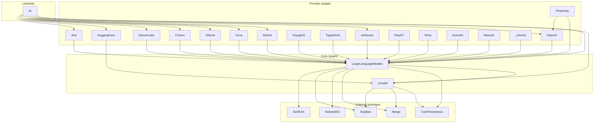

> [!IMPORTANT]
> 🕴️ This package is presently in its alpha stage of development (2026-03-04).

#### Supported Platforms

SPM platforms from [`Package.swift`](Package.swift): **iOS 16+**, **macOS 13+**, **tvOS 16+**, **visionOS 1+**, **watchOS 9+**.

<p align="left">
<picture>
  <source media="(prefers-color-scheme: dark)" srcset="Images/macos.svg">
  <source media="(prefers-color-scheme: light)" srcset="Images/macos-active.svg">
  
</picture>&nbsp;
  
<picture>
  <source media="(prefers-color-scheme: dark)" srcset="Images/ios.svg">
  <source media="(prefers-color-scheme: light)" srcset="Images/ios-active.svg">
  
</picture>&nbsp;

<picture>
  <source media="(prefers-color-scheme: dark)" srcset="Images/ipados.svg">
  <source media="(prefers-color-scheme: light)" srcset="Images/ipados-active.svg">
  
</picture>&nbsp;

<picture>
  <source media="(prefers-color-scheme: dark)" srcset="Images/tvos.svg">
  <source media="(prefers-color-scheme: light)" srcset="Images/tvos-active.svg">
  
</picture>&nbsp;

<picture>
  <source media="(prefers-color-scheme: dark)" srcset="Images/watchos.svg">
  <source media="(prefers-color-scheme: light)" srcset="Images/watchos-active.svg">
  
</picture>
</p>

Also targets **visionOS** (badge art not yet in `Images/`).

# AI

The definitive, open-source Swift framework for interfacing with generative AI.

## Documentation

- [Architecture](docs/ARCHITECTURE.md)
- [Contributing](CONTRIBUTING.md)
- [Changelog](CHANGELOG.md)

## Table of Contents

- [Architecture Overview](#architecture-overview)
- [Dependencies](#dependencies)
- [Installation](#installation)
- [Usage](#usage)
  - [Import the framework](#import-the-framework)
  - [Initialize an AI Client](#initialize-an-ai-client)
  - [LLM Clients Abstraction](#llm-clients-abstraction)
  - [Supported Models](#supported-models)
  - [Completions](#completions)
    - [Basic Completions](#basic-completions)
    - [Vision: Image-to-Text](#vision-image-to-text)
    - [Function Calling](#function-calling)
  - [DALLE-3 Image Generation](#dalle-3-image-generation)
  - [Audio](#audio)
    - [Audio Transcription: Whisper](#audio-transcription-whisper)
    - [Audio Generation: OpenAI](#audio-generation-openai)
    - [Audio Generation: ElevenLabs](#audio-generation-elevenlabs)
  - [Text Embeddings](#text-embeddings)
- [Roadmap](#roadmap)
- [Acknowledgements](#acknowledgements)
- [License](#license)

## Architecture Overview

This package is organized as a Swift Package Manager workspace with layered modules:

- `CoreMI` provides shared core abstractions used across providers.
- `LargeLanguageModels` builds common LLM request/response functionality on top of `CoreMI`.
- Provider modules (`OpenAI`, `Anthropic`, `Mistral`, `Groq`, `ElevenLabs`, etc.) implement vendor-specific APIs.
- `AI` is the umbrella product that re-exports the main modules for one-stop integration.

### Component Dependency Graph

A full dependency graph generated from `Package.swift` target dependencies is available in [docs/ARCHITECTURE.md](docs/ARCHITECTURE.md#component-dependency-graph).

## Dependencies

External package dependencies declared in `Package.swift`:

- [`CorePersistence`](https://github.com/vmanot/CorePersistence)
- [`Merge`](https://github.com/vmanot/Merge)
- [`NetworkKit`](https://github.com/vmanot/NetworkKit)
- [`Swallow`](https://github.com/vmanot/Swallow)
- [`SwiftUIX`](https://github.com/SwiftUIX/SwiftUIX)

# Installation

## Swift Package Manager

1. Open your Swift project in Xcode.
2. Go to `File` -> `Add Package Dependency`.
3. In the search bar, enter [this URL](https://github.com/PreternaturalAI/AI.git).
4. Choose the version you'd like to install.
5. Click `Add Package`.

Or add the dependency in `Package.swift`:

```swift
dependencies: [
    .package(url: "https://github.com/PreternaturalAI/AI.git", branch: "main")
]
```

Then link the `AI` product (umbrella) or a standalone product such as `OpenAI`, `Anthropic`, or `Perplexity` (see [Architecture](#architecture)).

# Architecture

The package is organized in layers. Provider SDKs implement shared protocols (`LLMRequestHandling`, embeddings, TTS, and so on) defined in the core modules.

| Layer | Modules | Responsibility |
|-------|---------|----------------|
| Umbrella module | `AI` | `@_exported` re-exports **CoreMI**, **LargeLanguageModels**, **OpenAI** (and Swallow macros client). Other bundled modules still need their own `import`. |
| Umbrella product | `AI` library | SPM product that **links** core + Anthropic, Cohere, ElevenLabs, Groq, HuggingFace, Jina, Mistral, Ollama, OpenAI, and the `AI` module |
| Providers | `OpenAI`, `Anthropic`, `Mistral`, `Groq`, `Ollama`, `Perplexity`, `Cohere`, `Jina`, `VoyageAI`, `TogetherAI`, `ElevenLabs`, `PlayHT`, `Rime`, `HumeAI`, `NeetsAI`, `_Gemini`, `HuggingFace`, … | API clients and model types |
| LLM abstractions | `LargeLanguageModels` | `AbstractLLM`, `PromptLiteral`, chat/function-calling, embeddings protocols |
| Foundations | `CoreMI` | Request handling, model identifiers, service credentials, ASR/TTS bases |
| External | Swallow, Merge, NetworkKit, CorePersistence, SwiftUIX | Shared infrastructure (see [Dependencies](#dependencies)) |

`import AI` is enough for OpenAI + shared LLM types. For other clients linked by the product, add e.g. `import Anthropic` or `import Groq`. Providers shipped only as standalone products (`Perplexity`, `_Gemini`, `VoyageAI`, …) require linking that product.

### Component dependency graph

Graph of **package targets** as declared in [`Package.swift`](Package.swift) (external packages shown once at the bottom). For products, tests, and design notes, see **[docs/ARCHITECTURE.md](docs/ARCHITECTURE.md)**.



**Notes**

- Most providers also depend on `CoreMI`, `CorePersistence`, `Merge`, `NetworkKit`, and `Swallow` directly (edges omitted above for readability where they already flow through `LargeLanguageModels`).
- **OpenAI** and **Anthropic** depend on `LargeLanguageModels` + networking stack, not on `CoreMI` directly in `Package.swift`.
- **Perplexity** is the only provider that depends on another provider target (`OpenAI`).
- **HuggingFace** depends on `CoreMI` + `Swallow` only (hub/tokenizer helpers, not the full LLM stack).
- The `AI` **product** does **not** link every target (for example `_Gemini`, `Perplexity`, `PlayHT`, `Rime`, `TogetherAI`, `VoyageAI`, `HumeAI`, `NeetsAI` are separate products).
- The `AI` **module** re-exports only CoreMI, LargeLanguageModels, and OpenAI among first-party modules (`Sources/AI/module.swift`).

### Protocol capabilities (from source)

Which shared protocols have an explicit client conformance today:

| Target | `LLMRequestHandling` | `TextEmbeddingsRequestHandling` | Notes |
|--------|:--------------------:|:-------------------------------:|-------|
| OpenAI | yes | yes | Also images, Whisper, speech, assistants |
| Anthropic | yes | | |
| Mistral | yes | yes | |
| Groq | yes | | |
| Ollama | yes | | |
| Perplexity | yes | | Depends on OpenAI target |
| Cohere | | yes | |
| Jina | | yes | |
| VoyageAI | | yes | |
| TogetherAI, ElevenLabs, PlayHT, Rime, HumeAI, NeetsAI, _Gemini, HuggingFace | | | Provider-specific client APIs / hub helpers (see `Sources/<Name>`) |

Full layering detail: **[docs/ARCHITECTURE.md](docs/ARCHITECTURE.md)**. Docs index: **[docs/README.md](docs/README.md)**.

# Dependencies

### External Swift packages

| Package | Repository | Role |
|---------|------------|------|
| Swallow | [vmanot/Swallow](https://github.com/vmanot/Swallow) | Extensions, macros client, diagnostics |
| Merge | [vmanot/Merge](https://github.com/vmanot/Merge) | Concurrency / async utilities |
| NetworkKit | [vmanot/NetworkKit](https://github.com/vmanot/NetworkKit) | HTTP client & API specifications |
| CorePersistence | [vmanot/CorePersistence](https://github.com/vmanot/CorePersistence) | Persistence & schema helpers (e.g. JSONSchema) |
| SwiftUIX | [SwiftUIX/SwiftUIX](https://github.com/SwiftUIX/SwiftUIX) | SwiftUI extensions |

Transitive pins (see [`Package.resolved`](Package.resolved)) include **SwiftAPI**, **swift-collections**, and **swift-syntax**.

### SPM products you can link

Exact product names from `Package.swift`:

| Product | Targets exposed | Use when |
|---------|-----------------|----------|
| `AI` | CoreMI, LargeLanguageModels, Anthropic, Cohere, ElevenLabs, Groq, HuggingFace, Jina, Mistral, Ollama, OpenAI, AI | Default multi-provider app dependency |
| `OpenAI` | OpenAI | OpenAI-only |
| `Anthropic` | Anthropic | Anthropic-only |
| `Perplexity` | Perplexity | Perplexity (pulls OpenAI transitively) |
| `TogetherAI` | TogetherAI | Together AI |
| `VoyageAI` | VoyageAI | Voyage embeddings |
| `PlayHT` | PlayHT | PlayHT voice |
| `Rime` | Rime | Rime voice |
| `HumeAI` | HumeAI | Hume |
| `NeetsAI` | NeetsAI | Neets |
| `_Gemini` | _Gemini | Google Gemini client |

There is **no** standalone SPM product today for `CoreMI`, `LargeLanguageModels`, `Cohere`, `Groq`, `HuggingFace`, `Jina`, `Mistral`, `Ollama`, or `ElevenLabs` — consume them via the `AI` product (or add a product in `Package.swift` if you need a leaner slice).

# Usage

## Import the framework

```diff
+ import AI
```

## Initialize an AI Client

Initialize an instance of an AI API provider of your choice. Here are some examples:

```swift
import AI

// OpenAI / GPT
import OpenAI

let client: OpenAI.Client = OpenAI.Client(apiKey: "YOUR_API_KEY")

// Anthropic / Claude
import Anthropic

let client: Anthropic.Client  = Anthropic.Client(apiKey: "YOUR_API_KEY")

// Mistral
import Mistral

let client: Mistral.Client = Mistral.Client(apiKey: "YOUR_API_KEY")

// Groq
import Groq

let client: Groq.Client = Groq.Client(apiKey: "YOUR_API_KEY")

// ElevenLabs
import ElevenLabs

let client: ElevenLabs.Client = ElevenLabs.Client(apiKey: "YOUR_API_KEY")

```

You can now use `client` as an interface to the supported providers. 

## LLM Clients Abstraction
If you need to abstract out the LLM Client (for example, if you want to allow your user to choose between clients), simply initialize an instance of `LLMRequestHandling` with an LLM API provider of your choice. Here are some examples:

```swift
import AI
import OpenAI
import Anthropic
import Mistral
import Groq

// OpenAI / GPT
let client: any LLMRequestHandling = OpenAI.Client(apiKey: "YOUR_API_KEY")
// Anthropic / Claude
let client: any LLMRequestHandling  = Anthropic.Client(apiKey: "YOUR_API_KEY")
// Mistral
let client: any LLMRequestHandling = Mistral.Client(apiKey: "YOUR_API_KEY")
// Groq
let client: any LLMRequestHandling = Groq.Client(apiKey: "YOUR_API_KEY")
```
You can now use `client` as an interface to an LLM as provided by the underlying provider.

## Supported Models
Each AI Client supports multiple models. For example:

```swift
// OpenAI GPT Models
let gpt_4o_Model: OpenAI.Model = .gpt_4o
let gpt_4_Model: OpenAI.Model = .gpt_4
let gpt_3_5_Model: OpenAI.Model = .gpt_3_5
let otherGPTModels: OpenAI.Model = .chat(.gpt_OTHER_MODEL_OPTIONS)

// Open AI Text Embedding Models
let smallTextEmbeddingsModel: OpenAI.Model = .embedding(.text_embedding_3_small)
let largeTextEmbeddingsModel: OpenAI.Model = .embedding(.text_embedding_3_large)
let adaTextEmbeddingsModel: OpenAI.Model = .embedding(.text_embedding_ada_002)

// Anthropic Models
let caludeHaikuModel: Anthropic.Model = .haiku
let claudeSonnetModel: Anthropic.Model = .sonnet
let claudeOpusModel: Anthropic.Model = .opus

// Mistral Models
let mistralTiny: Mistral.Model = .mistral_tiny
let mistralSmall: Mistral.Model = Mistral.Model.mistral_small
let mistralMedium: Mistral.Model = Mistral.Model.mistral_medium

// Groq Models
let gemma_7b: Groq.Model = .gemma_7b
let llama3_8b: Groq.Model = .llama3_8b
let llama3_70b: Groq.Model = .llama3_70b
let mixtral_8x7b: Groq.Model = .mixtral_8x7b

// ElevenLabs Models
let multilingualV2: ElevenLabs.Model = .MultilingualV2
let turboV2: ElevenLabs.Model = .TurboV2 // English
let multilingualV1: ElevenLabs.Model = .MultilingualV1
let englishV1: ElevenLabs.Model = .EnglishV1
```

## Completions
### Basic Completions

Modern Large Language Models (LLMs) operate by receiving a series of inputs, often in the form of messages or prompts, and completing the inputs with the next probable output based on calculations performed by their complex neural network architectures that leverage the vast amounts of data on which it was trained.

You can use the `LLMRequestHandling.complete(_:model:)` function to generate a chat completion for a specific model of your choice. For example:

```swift
import AI
import OpenAI

let client: any LLMRequestHandling = OpenAI.Client(apiKey: "YOUR_KEY")

// the system prompt is optional
let systemPrompt: PromptLiteral = "You are an extremely intelligent assistant."
let userPrompt: PromptLiteral = "What is the meaning of life?"

let messages: [AbstractLLM.ChatMessage] = [
        .system(systemPrompt),
        .user(userPrompt)
  ]

// Each of these is Optional
let parameters = AbstractLLM.ChatCompletionParameters(
    // .max or maximum amount of tokens is default
    tokenLimit: .fixed(200), 
    // controls the randomness of the result
    temperatureOrTopP: .temperature(1.2), 
    // stop sequences that indicate to the model when to stop generating further text
    stops: ["END OF CHAPTER"],
    // check the function calling section below
    functions: nil)

let model: OpenAI.Model = .gpt_4o

do {
    let result: String = try await client.complete(
        messages,
        parameters: parameters,
        model: model,
        as: .string)
    
    return result
} catch {
    print(error)
}
```

### Vision: Image-to-Text
Language models (LLMs) are rapidly evolving and expanding into multimodal capabilities. This shift signifies a major transformation in the field, as LLMs are no longer limited to understanding and generating text. With Vision, LLMs can take an image as an input, and provide information about the content of the image.

```swift
import AI
import OpenAI

let client: any LLMRequestHandling = OpenAI.Client(apiKey: "YOUR_KEY")

let systemPrompt: PromptLiteral = "You are a VisionExpertGPT. You will receive an image. Your job is to list all the items in the image and write a one-sentence poem about each item. Make sure your poems are creative, capturing the essence of each item in an evocative and imaginative way."

let userPrompt: PromptLiteral = "List the items in this image and write a short one-sentence poem about each item. Only reply with the items and poems. NOTHING MORE."

// Image or NSImage is supported
let imageLiteral = try PromptLiteral(image: imageInput) 

let model = OpenAI.Model.gpt_4o
  
let messages: [AbstractLLM.ChatMessage] = [
    .system(systemPrompt),
    .user {
        .concatenate(separator: nil) {
            userPrompt
            imageLiteral
        }
    }]

let result: String = try await client.complete(
    messages,
    model: model,
    as: .string
)

return result
```

## Function Calling
Adding function calling in your completion requests allows your app to receive a structured JSON response from an LLM, ensuring a consistent data format. 

To demonstrate how powerful Function Calling can be, we will use the example of using a screenshot organizing app. The PhotoKit API already has a functionality to identify only photos that are screenshots. So just getting the user’s screenshots and putting them into an app is something that is simple enough to accomplish. 

But now, with the power of LLMs, we can easily organize the screenshots by categories, provide a summary for each one, and add search functionality across all screenshots by having clear detailed text descriptions. In the future, we can add additional information, such as extracting any text or links included in the screenshot to make it easily actionable, and even extract specific elements from the screenshot. 

To make a function call, we must first image an function in our app that would save the screenshot. What parameters does it need? These function parameters is what the LLM Function Calling tool will return for us so that we can call our function:

```swift
// Note that since LLMs are trained mainly on web APIs, we have to image web API function names for better results
func addScreenshotAnalysisToDB(
    with title: String,
    summary: String,
    description: String,
    category: String
) {
    // this function does not exist in our app, but we pretend that it does for the purpose of using function calling to get a JSON response of the function parameters.
}
```

```swift
import OpenAI
import CorePersistence

let client = OpenAI.Client(apiKey: "YOUR_API_KEY")

let systemPrompt: PromptLiteral = """
You are an AI trained to analyze mobile screenshots and provide detailed information about them. Your task is to examine a given screenshot and generate the following details:

* Title: Create a concise title (3-5 words) that accurately represents the content of the screenshot.
* Summary: Write a brief, one-sentence summary providing an overview of what is depicted in the screenshot.
* Description: Compose a comprehensive description that elaborates on the contents of the screenshot. Include key details and keywords to facilitate easy searching.
* Category: Assign a single-word tag or category that best describes the screenshot. Examples include 'music', 'art', 'movie', 'fashion', etc. Avoid using 'app' as a category since all items are app-related.

Make sure your responses are clear, specific, and relevant to the content of the screenshot.
"""

let userPrompt: PromptLiteral = "Please analyze the attached screenshot and provide the following details: (1) a concise title (3-5 words) that describes the screenshot, (2) a brief one-sentence summary of the screenshot content, (3) a detailed description including key details and keywords for easy searching, and (4) a single-word category that best describes the screenshot (e.g., music, art, movie, fashion)."

let screenshotImageLiteral = try PromptLiteral(image: screenshot)

let messages: [AbstractLLM.ChatMessage] = [
    .system(systemPrompt),
    .user {
        .concatenate(separator: nil) {
            userPrompt
            screenshotImageLiteral
        }
    }]
 
struct AddScreenshotFunctionParameters: Codable, Hashable, Sendable {
    let title: String
    let summary: String
    let description: String
    let category: String
}

do {
    let screenshotFunctionParameterSchema: JSONSchema = try JSONSchema(
        type: AddScreenshotFunctionParameters.self,
        description: "Detailed information about a mobile screenshot for organizational purposes.",
        propertyDescriptions: [
            "title": "A concise title (3-5 words) that accurately represents the content of the screenshot.",
            "summary": "A brief, one-sentence summary providing an overview of what is depicted in the screenshot.",
            "description": "A comprehensive description that elaborates on the contents of the screenshot. Include key details and keywords to facilitate easy searching.",
            "category": "A single-word tag or category that best describes the screenshot. Examples include: 'music', 'art', 'movie', 'fashion', etc. Avoid using 'app' as a category since all items are app-related."
        ],
        required: true
    )
    
    let screenshotAnalysisProperties: [String : JSONSchema] = ["screenshot_analysis_parameters" : screenshotFunctionParameterSchema]
    
    let addScreenshotAnalysisFunction = AbstractLLM.ChatFunctionDefinition(
        name: "add_screenshot_analysis_to_db",
        context: "Adds analysis of a mobile screenshot to the database",
        parameters: JSONSchema(
            type: .object,
            description: "Screenshot Analysis",
            properties: screenshotAnalysisProperties
        )
    )

    let functionCall: AbstractLLM.ChatFunctionCall = try await client.complete(
        messages,
        functions: [addScreenshotAnalysisFunction],
        as: .functionCall
    )
    
    struct ScreenshotAnalysisResult: Codable, Hashable, Sendable {
        let screenshotAnalysisParameters: AddScreenshotFunctionParameters
    }

    let result = try functionCall.decode(ScreenshotAnalysisResult.self)
    print(result.screenshotAnalysisParameters)
    
} catch {
    print(error)
}
```

## DALLE-3 Image Generation
With OpenAI's DALLE-3, text-to-image generation is as easy as just providing a prompt. This gives us, as Apple Developers, the opportunity to include very personalized images for all kinds of use-cases instead of using any generic stock images. 

For instance, consider we are building a personal journal app. With the DALLE-3 Image Generation API by OpenAI, we can generate a unique, beautiful image for each journal entry. 

```swift
import AI
import OpenAI

let client: any LLMRequestHandling = OpenAI.Client(apiKey: "YOUR_KEY")

// user's journal entry for today. 
// Note that the imagePrompt should be less than 4000 characters. 
let imagePrompt = "Today was an unforgettable day in Japan, filled with awe and wonder at every turn. We began our journey in the bustling streets of Tokyo, where the neon lights and towering skyscrapers left us mesmerized. The serene beauty of the Meiji Shrine provided a stark contrast, offering a peaceful retreat amidst the city's chaos. We indulged in delicious sushi at a local restaurant, the flavors so fresh and vibrant. Later, we took a train to Kyoto, where the sight of the historic temples and the tranquil Arashiyama Bamboo Grove left us breathless. The day ended with a soothing dip in an onsen, the hot springs melting away all our fatigue. Japan's blend of modernity and tradition, coupled with its unparalleled hospitality, made this trip a truly magical experience."

let images = try await openAIClient.createImage(
    prompt: imagePrompt,
    // either standard or hd (costs more)
    quality: OpenAI.Image.Quality.standard,
    // 1024x1024, 1792x1024, or 1024x1792 supported
    size: OpenAI.Image.Size.w1024h1024,
    // either vivid or natural
    style: OpenAI.Image.Style.vivid

if let imageURL = images.first?.url {
    return URL(string: imageURL)
}
```

## Audio
Adding audio generation and transcription to mobile apps is becoming increasingly important as users grow more comfortable speaking directly to apps for responses or having their audio input transcribed efficiently. Preternatural enables seamless integration with these cutting-edge, continually improving AI technologies.

### Audio Transcription: Whisper
[Whisper](https://openai.com/index/whisper/), created and open-sourced by OpenAI, is an Automatic Speech Recognition (ASR) system trained on 680,000 hours of mostly English audio content collected from the web. This makes Whisper particularly impressive at transcribing audio with background noise and varying accents compared to its predecessors. Another notable feature is its ability to transcribe audio with correct sentence punctuation.

```swift
import OpenAI

let client = OpenAI.Client(apiKey: "YOUR_API_KEY")

// supported formats include flac, mp3, mp4, mpeg, mpga, m4a, ogg, wav, or webm
let audioFile = URL(string: "YOUR_AUDIO_FILE_URL_PATH")

// Optional - great for including correct spelling of audio-specific keywords
// For example, here we provide the correct spelling for company-spefic words in an earnings call
let prompt = "ZyntriQix, Digique Plus, CynapseFive, VortiQore V8, EchoNix Array, OrbitalLink Seven, DigiFractal Matrix, PULSE, RAPT, B.R.I.C.K., Q.U.A.R.T.Z., F.L.I.N.T."

// Optional - Supplying the input language in ISO-639-1 format will improve accuracy and latency.
// While Whisper supports 98 languages, note that languages other than English have a high error rate, so test thoroughly
let language: LargeLanguageModels.ISO639LanguageCode = .en

// The sampling temperature, between 0 and 1.
// Higher values like 0.8 will make the output more random, while lower values like 0.2 will make it more focused and deterministic.
// If set to 0, the model will use log probability to automatically increase the temperature until certain thresholds are hit.
let temperature = 0

// Optional - Setting Timestamp Granularities provides the time stamps for roughly every sentence in the transcription. 
// note that the timestampGranularties is an array of granularities, so you can inlcude both .segment and .word granularities, or simple one of them
let timestampGranularities: [OpenAI.AudioTranscription.TimestampGranularity] = [.segment, .word]

do {
    let transcription = try await openAIClient.createTranscription(
        audioFile: audioFile, 
        prompt: prompt,
        language: language,
        temperature: temperature,
        timestampGranularities: timestampGranularities
    )
    
    let fullTranscription = transcription.text
    let segements = transcription.segments
    let words = transcription.words
} catch {
    print(error)
}
```

### Audio Generation: OpenAI
Preternatural offers a simple Text-to-Speech (TTS) integration with OpenAI: 

```swift
import OpenAI

let client = OpenAI.Client(apiKey: "YOUR_API_KEY")

// OpenAI offers two Text-to-Speech (TTS) Models at this time.
// The tts-1 is  the latest text to speech model, optimized for speed and is ideal to use for real-time text to speech use cases. 
let tts_1: OpenAI.Model.Speech = .tts_1
// The tts-1-hd is the latest text to speech model, optimized for quality.
let tts_1_hd: OpenAI.Model.Speech = .tts_1_hd

// text for audio generation
let textInput = "In a quiet, unassuming village nestled deep in a lush, verdant valley, young Elara leads a simple life, dreaming of adventure beyond the horizon. Her village is filled with ancient folklore and tales of mystical relics, but none capture her imagination like the legend of the Enchanted Amulet—a powerful artifact said to grant its bearer the ability to control time."

// OpenAI currently offers 6 voice options
// Listen to voice samples are on their website: https://platform.openai.com/docs/guides/text-to-speech
let alloy: OpenAI.Speech.Voice = .alloy
let echo: OpenAI.Speech.Voice = .echo
let fable: OpenAI.Speech.Voice = .fable
let onyx: OpenAI.Speech.Voice = .onyx
let nova: OpenAI.Speech.Voice = .nova
let shimmer: OpenAI.Speech.Voice = .shimmer

// The OpenAI API offers the ability to adjust the speed of the audio.
// Speed between 0.25 and 4.0 could be selected, with 1.0 as the default. 
let speed = 1.0

let speech: OpenAI.Speech = try await openAIClient.createSpeech(
    model: tts_1,
    text: textInput,
    voice: alloy,
    speed: speed)

let audioData = speech.data
```

### Audio Generation: ElevenLabs
[ElevenLabs](https://elevenlabs.io/) is a voice AI research & deployment company providing the ability to generate speech in hundreds of new and existing voices in 29 languages. They also allow voice cloning - provide only 1 minute of audio and you could generate a new voice! 

```swift
import ElevenLabs

let client = ElevenLabs.Client(apiKey: "YOUR_API_KEY")

// ElevenLabs offers Multilingual and English-specific models
// More details on their website here: https://elevenlabs.io/docs/speech-synthesis/models
let model: ElevenLabs.Model = .MultilingualV2

// Select the voice you would like for the audio on the ElevenLabs website
// Note that you first have to add voices from the Voice Lab, then check your Voices for the ID
let voiceID = "4v7HtLWqY9rpQ7Cg2GT4"

let textInput = "In a quiet, unassuming village nestled deep in a lush, verdant valley, young Elara leads a simple life, dreaming of adventure beyond the horizon. Her village is filled with ancient folklore and tales of mystical relics, but none capture her imagination like the legend of the Enchanted Amulet—a powerful artifact said to grant its bearer the ability to control time."

// Optional - if you set any or all settings to nil, default values will be used
let voiceSettings: ElevenLabs.VoiceSettings = .init(
    // Increasing stability will make the voice more consistent between re-generations, but it can also make it sounds a bit monotone. On longer text fragments it is recommended to lower this value. 
    // this is a double between 0 (more variable) and 1 (more stable)
    stability: 0.5,
    // Increasing the Similarity Boost setting enhances the overall voice clarity and targets speaker similarity. 
    // this is a double between 0 (Low) and 1 (High)
    similarityBoost: 0.75,
    // High values are recommended if the style of the speech should be exaggerated compared to the selected voice. Higher values can lead to more instability in the generated speech. Setting this to 0 will greatly increase generation speed and is the default setting.
    // this is a double between 0 (Low) and 1 (High)
    styleExaggeration: 0.0,
    // Boost the similarity of the synthesized speech and the voice at the cost of some generation speed.
    speakerBoost: true)

do {
    let speech = try await client.speech(
        for: textInput,
        voiceID: voiceID,
        voiceSettings: voiceSettings,
        model: model
    )
    
    return speech
} catch {
    print(error)
}
```

## Text Embeddings
Text embedding models are translators for machines. They convert text, such as sentences or paragraphs, into sets of numbers, which the machine can easily use in complex calculations. The biggest use-case for Text Embeddings is improving Search in your application. 

Just simply provide any text and the model will return an embedding (an array of doubles) of that text back. 

```swift
import AI
import OpenAI

let client: any LLMRequestHandling = OpenAI.Client(apiKey: "YOUR_KEY")

// supported models (Only OpenAI Embeddings Models are supported)
let smallTextEmbeddingsModel: OpenAI.Model = .embedding(.text_embedding_3_small)
let largeTextEmbeddingsModel: OpenAI.Model = .embedding(.text_embedding_3_large)
let adaTextEmbeddingsModel: OpenAI.Model = .embedding(.text_embedding_ada_002)

let textInput = "Hello, Text Embeddings!"

let textEmbeddingsModel: OpenAI.Model = .embedding(.text_embedding_3_small)

let embeddings = try await LLMManager.client.textEmbeddings(
    for: [textInput],
    model: textEmbeddingsModel)
    
return embeddings.data.first?.embedding.description
```

# Documentation

| Document | Contents |
|----------|----------|
| **[docs/README.md](docs/README.md)** | Documentation index |
| **[docs/ARCHITECTURE.md](docs/ARCHITECTURE.md)** | Full architecture, products vs targets, Mermaid graph, protocol matrix, tests |
| **[CONTRIBUTING.md](CONTRIBUTING.md)** | Dev setup, coding guidelines, how to add a provider |
| **[CHANGELOG.md](CHANGELOG.md)** | Release notes and unreleased changes |
| **[LICENSE](LICENSE)** | MIT License text |

API behavior is illustrated in the [Usage](#usage) sections above; protocol details live in `Sources/LargeLanguageModels` and `Sources/CoreMI`.

# Roadmap

Status reflects modules present in this repository (`Sources/` + `Package.swift`). Checked items ship as package targets; depth of feature coverage varies by provider.

### Core

- [x] `CoreMI` — request handling, model identifiers, services, ASR/TTS foundations
- [x] `LargeLanguageModels` — `AbstractLLM`, prompts, function calling, embeddings protocols
- [x] `AI` umbrella product

### LLM & multimodal providers

- [x] OpenAI (chat, vision, tools, images, Whisper, speech)
- [x] Anthropic
- [x] Mistral
- [x] Groq
- [x] Ollama
- [x] Perplexity
- [x] TogetherAI
- [x] `_Gemini` (Google Gemini client; standalone product)
- [ ] Broader parity matrix (streaming, tools, vision) across every LLM provider

### Embeddings & hub

- [x] OpenAI embeddings
- [x] Cohere
- [x] Jina
- [x] VoyageAI
- [x] Hugging Face hub helpers / tokenizer resources

### Voice & speech

- [x] ElevenLabs
- [x] PlayHT
- [x] Rime
- [x] HumeAI
- [x] NeetsAI
- [x] OpenAI TTS / Whisper

### Project hygiene

- [x] Architecture & dependency documentation
- [x] Contributing guide, docs index, PR template & changelog
- [ ] Register missing test targets (Ollama, Rime, TogetherAI folder)
- [ ] visionOS badge artwork under `Images/`
- [ ] Tagged semantic releases with automated changelog sections

# Contributing

Contributions are welcome. Please read **[CONTRIBUTING.md](CONTRIBUTING.md)** for:

- Environment and build requirements
- PR expectations and testing notes
- Steps to add or extend a provider without breaking layering rules

# Changelog

See **[CHANGELOG.md](CHANGELOG.md)** for user-visible changes. The package is in **alpha**; expect API evolution between releases.

# Acknowledgements

- [similarity-search-kit](https://github.com/ZachNagengast/similarity-search-kit)
- [Tiktoken](https://github.com/aespinilla/Tiktoken)

# License

This package is licensed under the [MIT License](LICENSE).
