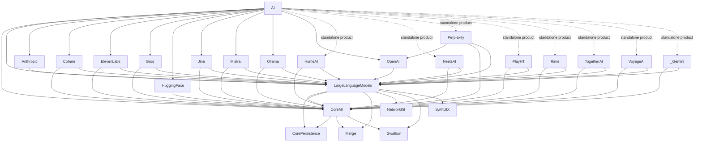

# Architecture

This document summarizes the package architecture as defined in `Package.swift`.

## Module Layers

1. **Core layer**
   - `CoreMI`
2. **LLM abstraction layer**
   - `LargeLanguageModels`
3. **Provider layer**
   - `Anthropic`, `Cohere`, `ElevenLabs`, `Groq`, `HuggingFace`, `HumeAI`, `Jina`, `Mistral`, `NeetsAI`, `Ollama`, `OpenAI`, `Perplexity`, `PlayHT`, `Rime`, `TogetherAI`, `VoyageAI`, `_Gemini`
4. **Umbrella layer**
   - `AI`

## Component Dependency Graph

> Note: The `AI` umbrella target currently depends on `CoreMI`, `LargeLanguageModels`, `Anthropic`, `Cohere`, `ElevenLabs`, `Groq`, `HuggingFace`, `Jina`, `Mistral`, `Ollama`, and `OpenAI`. Other provider modules in this repository are distributed as standalone products and are not re-exported by `AI` in `Package.swift`.

## External Dependencies

- `CorePersistence`
- `Merge`
- `NetworkKit`
- `Swallow`
- `SwiftUIX`
