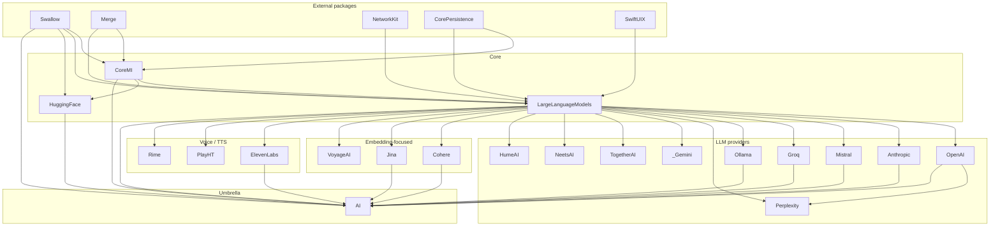

# Architecture

This document describes the structure of the **AI** Swift package as defined by [`Package.swift`](../Package.swift) and the modules under [`Sources/`](../Sources).

## Overview

The package is a layered Swift framework for generative AI on Apple platforms. Higher layers depend only on lower layers; provider SDKs plug into shared protocols rather than into each other (with one documented exception: **Perplexity** depends on **OpenAI** for shared types).

```
┌─────────────────────────────────────────────────────────────┐
│  Products (importable libraries)                            │
│  AI (umbrella) · OpenAI · Anthropic · … · _Gemini · …       │
└─────────────────────────────┬───────────────────────────────┘
                              │
┌─────────────────────────────▼───────────────────────────────┐
│  Provider targets                                           │
│  OpenAI, Anthropic, Mistral, Groq, Ollama, …                │
│  Implement LLMRequestHandling / embeddings / TTS / etc.     │
└─────────────────────────────┬───────────────────────────────┘
                              │
┌─────────────────────────────▼───────────────────────────────┐
│  LargeLanguageModels                                        │
│  AbstractLLM, PromptLiteral, embeddings protocols           │
└─────────────────────────────┬───────────────────────────────┘
                              │
┌─────────────────────────────▼───────────────────────────────┐
│  CoreMI                                                     │
│  Request handling, model IDs, services, ASR/TTS foundations │
└─────────────────────────────┬───────────────────────────────┘
                              │
┌─────────────────────────────▼───────────────────────────────┐
│  External packages                                          │
│  Swallow · Merge · NetworkKit · CorePersistence · SwiftUIX  │
└─────────────────────────────────────────────────────────────┘
```

## Platform support

Declared in `Package.swift`:

| Platform   | Minimum |
|------------|---------|
| iOS        | 16      |
| macOS      | 13      |
| tvOS       | 16      |
| visionOS   | 1       |
| watchOS    | 9       |

Swift tools version: **5.10**. Many targets enable the experimental `AccessLevelOnImport` feature.

## Module layers

### CoreMI

**Path:** `Sources/CoreMI`  
**Depends on:** CorePersistence, Merge, Swallow

Foundation types for machine-intelligence services:

- `CoreMI.RequestHandling` — generic generative request interface
- Model identifiers (`ModelIdentifier`, providers, scopes)
- Service client / credential / account protocols
- ASR and TTS request foundations (`TTSRequestHandling`, speech synthesizer types)

### LargeLanguageModels

**Path:** `Sources/LargeLanguageModels`  
**Depends on:** CorePersistence, CoreMI, Merge, NetworkKit, Swallow, SwiftUIX  
**Resources:** `Resources/` (e.g. stopwords)

Provider-agnostic LLM surface:

- `LLMRequestHandling` — chat/text completion and streaming (extends `CoreMI.RequestHandling`)
- `AbstractLLM` — prompts, messages, roles, completion parameters, function calling, agents
- `PromptLiteral` — typed prompt construction (text, images, interpolation)
- `TextEmbeddingsRequestHandling` — embedding requests
- Task dependencies (`TaskDependencyValues.llm`, `.embedding`)

### Provider targets

Each provider lives under `Sources/<Name>` and typically exposes a `Client` that conforms to one or more of:

- `LLMRequestHandling`
- `TextEmbeddingsRequestHandling`
- TTS / speech APIs (where applicable)
- Provider-specific REST models via NetworkKit

| Target | Role (from source layout) | Notable dependencies beyond LLM stack |
|--------|---------------------------|----------------------------------------|
| **OpenAI** | Chat, vision, tools, images, Whisper, TTS, assistants | LargeLanguageModels, Merge, NetworkKit, Swallow |
| **Anthropic** | Claude chat / tools | LargeLanguageModels, Merge, NetworkKit, Swallow |
| **Mistral** | Chat + embeddings | CoreMI, CorePersistence, LLM stack |
| **Groq** | Fast LLM inference | CoreMI, CorePersistence, LLM stack |
| **Ollama** | Local LLM HTTP API | CoreMI, CorePersistence, LLM stack |
| **Perplexity** | Search-oriented LLM | **Also depends on OpenAI** |
| **Cohere** | Embeddings-focused client | CoreMI, CorePersistence, LLM stack |
| **Jina** | Embeddings | CoreMI, CorePersistence, LLM stack |
| **VoyageAI** | Embeddings | CoreMI, CorePersistence, LLM stack |
| **TogetherAI** | Hosted open models / embeddings | CoreMI, CorePersistence, LLM stack |
| **ElevenLabs** | Voice / TTS | CoreMI, CorePersistence, LLM stack |
| **PlayHT** | Voice / TTS | CoreMI, CorePersistence, LLM stack |
| **Rime** | Voice / TTS | CoreMI, CorePersistence, LLM stack |
| **HumeAI** | Empathic voice / chat APIs | CoreMI, CorePersistence, LLM stack |
| **NeetsAI** | Voice / chat | CoreMI, CorePersistence, LLM stack |
| **_Gemini** | Google Gemini (content, files, embeddings, tools) | CoreMI, CorePersistence, LLM stack |
| **HuggingFace** | Hub download / tokenizer resources | **CoreMI, Swallow only** (no LargeLanguageModels) |

### AI (umbrella module vs product)

**Path:** `Sources/AI`  
**Target depends on:** CoreMI, LargeLanguageModels, Anthropic, Cohere, ElevenLabs, Groq, HuggingFace, Jina, Mistral, Ollama, OpenAI, Swallow

Distinguish **module** from **product**:

| Concept | What it does |
|---------|----------------|
| **`AI` module** (`Sources/AI/module.swift`) | `@_exported import` of **CoreMI**, **LargeLanguageModels**, **OpenAI**, and **SwallowMacrosClient** only |
| **`AI` product** (`.library(name: "AI", …)`) | Links the modules listed below so clients may `import` them when depending on the product |

So `import AI` brings OpenAI + shared LLM/CoreMI APIs into scope. Modules such as Anthropic or Groq are available to import when the `AI` product is linked, but they are **not** re-exported by the `AI` module.

## Protocol capability matrix

Explicit conformances found under `Sources/` (not an exhaustive feature matrix for every API surface):

| Target | `LLMRequestHandling` | `TextEmbeddingsRequestHandling` | Other surfaces (illustrative) |
|--------|:--------------------:|:-------------------------------:|-------------------------------|
| OpenAI | ✓ (`OpenAI.Client+LLMRequestHandling`) | ✓ | Images, Whisper, speech, assistants |
| Anthropic | ✓ | | Tools / chat messages |
| Mistral | ✓ | ✓ | |
| Groq | ✓ | | |
| Ollama | ✓ | | Local HTTP API |
| Perplexity | ✓ | | Uses OpenAI target |
| Cohere | | ✓ | |
| Jina | | ✓ | |
| VoyageAI | | ✓ | |
| TogetherAI | | | Client + embeddings types (check module) |
| ElevenLabs / PlayHT / Rime | | | Voice / TTS clients |
| HumeAI / NeetsAI | | | Provider clients |
| _Gemini | | | Content, files, embeddings, tools (Gemini-specific) |
| HuggingFace | | | Hub download / tokenizer resources |
| LargeLanguageModels | | ✓ (`NLEmbeddingProvider` et al.) | `PromptLiteral`, `AbstractLLM` |

## Products vs targets

### Umbrella product

```swift
.library(name: "AI", targets: [
  "CoreMI", "LargeLanguageModels",
  "Anthropic", "Cohere", "ElevenLabs", "Groq", "HuggingFace",
  "Jina", "Mistral", "Ollama", "OpenAI", "AI",
])
```

### Standalone products

Declared as their own `.library` entries (link without the full umbrella product):

- `_Gemini`, `Anthropic`, `HumeAI`, `NeetsAI`, `OpenAI`, `Perplexity`, `PlayHT`, `Rime`, `TogetherAI`, `VoyageAI`

### Targets without a dedicated product

Linked only via the `AI` product (unless you add a new `.library`):

- `CoreMI`, `LargeLanguageModels`, `Cohere`, `ElevenLabs`, `Groq`, `HuggingFace`, `Jina`, `Mistral`, `Ollama`, and the `AI` module itself
## Dependency graph (internal)

Derived from `Package.swift` target `dependencies` (external packages collapsed to a single node where helpful).



### Compact target → internal dependency list

| Target | Internal package targets |
|--------|---------------------------|
| CoreMI | — |
| LargeLanguageModels | CoreMI |
| HuggingFace | CoreMI |
| OpenAI | LargeLanguageModels *(plus Merge, NetworkKit, Swallow externally)* |
| Anthropic | LargeLanguageModels *(plus Merge, NetworkKit, Swallow externally)* |
| Mistral, Groq, Ollama, Cohere, Jina, VoyageAI, TogetherAI, ElevenLabs, PlayHT, Rime, HumeAI, NeetsAI, _Gemini | CoreMI, LargeLanguageModels |
| Perplexity | CoreMI, LargeLanguageModels, **OpenAI** |
| AI | CoreMI, LargeLanguageModels, Anthropic, Cohere, ElevenLabs, Groq, HuggingFace, Jina, Mistral, Ollama, OpenAI |

OpenAI and Anthropic do **not** list `CoreMI` in `Package.swift`; they reach CoreMI types transitively through `LargeLanguageModels`.

## External dependencies

Declared in `Package.swift`:

| Package | URL | Purpose (typical use in this repo) |
|---------|-----|--------------------------------------|
| [Swallow](https://github.com/vmanot/Swallow) | branch `master` | Standard library extensions, macros client, diagnostics utilities |
| [Merge](https://github.com/vmanot/Merge) | branch `master` | Concurrency / async utilities |
| [NetworkKit](https://github.com/vmanot/NetworkKit) | branch `master` | HTTP API client layer for provider specs |
| [CorePersistence](https://github.com/vmanot/CorePersistence) | branch `main` | Persistence / schema helpers (e.g. JSONSchema) |
| [SwiftUIX](https://github.com/SwiftUIX/SwiftUIX) | branch `master` | SwiftUI extensions used by LLM UI-adjacent types |

Resolved transitive pins (see `Package.resolved`) include **SwiftAPI**, **swift-collections**, and **swift-syntax**.

## Tests

Test targets under `Tests/` generally depend on the `AI` product (plus `Swallow`). `_GeminiTests` also depends on `_Gemini` directly.

| Test target (`Package.swift`) | Path |
|-------------------------------|------|
| LargeLanguageModelsTests | `Tests/LargeLanguageModels` |
| AnthropicTests | `Tests/Anthropic` |
| OpenAITests | `Tests/OpenAI` |
| MistralTests | `Tests/Mistral` |
| GroqTests | `Tests/Groq` |
| PerplexityTests | `Tests/Perplexity` |
| ElevenLabsTests | `Tests/ElevenLabs` |
| PlayHTTests | `Tests/PlayHT` |
| JinaTests | `Tests/Jina` |
| VoyageAITests | `Tests/VoyageAI` |
| CohereTests | `Tests/Cohere` |
| HuggingFaceTests | `Tests/HuggingFace` |
| NeetsAITests | `Tests/NeetsAI` |
| HumeAITests | `Tests/HumeAI` |
| _GeminiTests | `Tests/_Gemini` |

### Gaps (as of this doc)

| Area | Observation |
|------|-------------|
| **Ollama** | Source target exists; **no** `OllamaTests` test target |
| **Rime** | Source target exists; **no** `RimeTests` test target |
| **TogetherAI** | `Tests/TogetherAI/` directory exists, but **no** matching `.testTarget` in `Package.swift` |
| **CoreMI** | No dedicated `CoreMITests` target |

## Design notes

1. **Protocol-oriented providers** — App code can depend on `any LLMRequestHandling` and swap OpenAI, Anthropic, Groq, etc. without rewriting call sites.
2. **Product vs module** — Depending on the `AI` **product** links many modules; `import AI` only re-exports CoreMI, LargeLanguageModels, and OpenAI. Import other modules explicitly.
3. **Lean linking** — Prefer a standalone product (e.g. `OpenAI`) when you do not need the multi-provider product surface.
4. **NetworkKit API specs** — Most providers define an `*.APISpecification` and map responses into `AbstractLLM` types.
5. **Experimental Swift features** — `AccessLevelOnImport` is enabled on most targets; keep import access consistent when adding files.

## Related docs

- [docs/README.md](README.md) — documentation index
- [README](../README.md) — installation and usage
- [CONTRIBUTING](../CONTRIBUTING.md) — how to extend the package
- [CHANGELOG](../CHANGELOG.md) — release history
